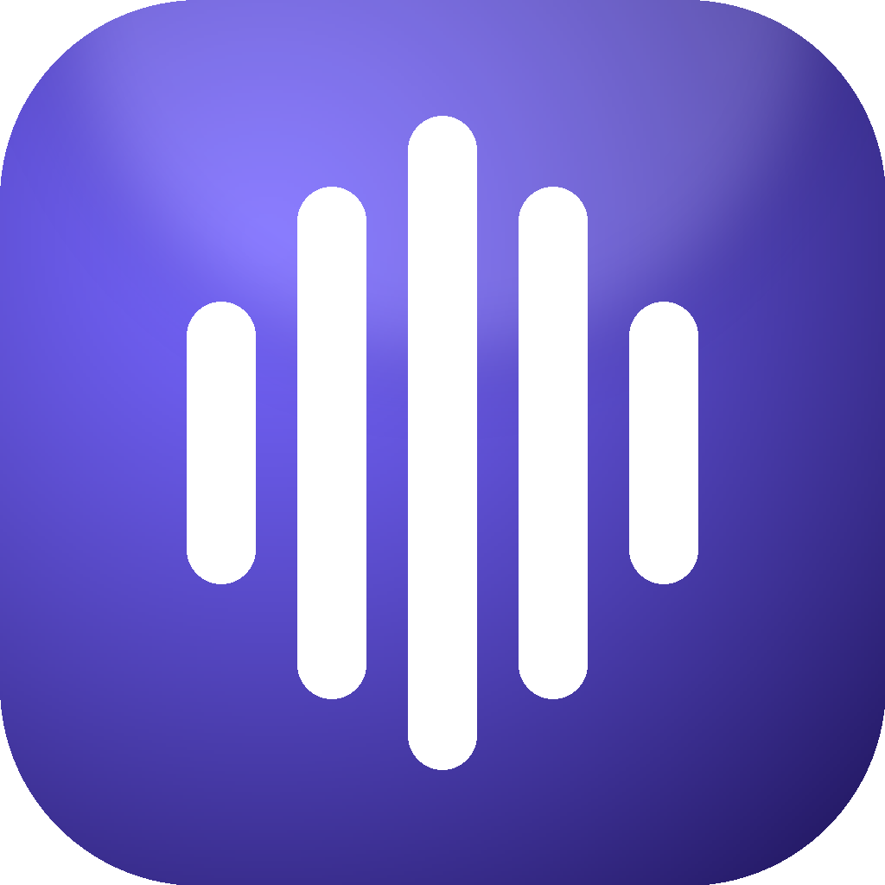

<p align="center">
  
</p>

<h1 align="center">MacVibe</h1>

<p align="center">
  Global dictation for macOS. Tap right <kbd>⌥</kbd>, talk, tap again —<br>
  your words land wherever you were already typing.
</p>

<p align="center">
  <a href="https://github.com/natexcvi/mac-vibe/releases/latest"></a>
  
  <a href="LICENSE"></a>
</p>

---

Everything runs on your Mac — audio never leaves the machine. MacVibe lives in
the menubar, has no Dock icon, and stays out of the way until you tap for it.

## Install

**[Download the latest .dmg](https://github.com/natexcvi/mac-vibe/releases/latest)**,
drag MacVibe to Applications, and launch it. It's signed and notarized, so
Gatekeeper won't complain. Updates install themselves.

Requires an **Apple Silicon** Mac on **macOS 14+**.

On first launch MacVibe downloads its speech model (~1.6 GB, once — updates
don't re-download it) and asks for two permissions:

- **Microphone** — to hear you.
- **Accessibility** — to catch the right <kbd>⌥</kbd> tap globally and paste.

If pasting ever fails, Accessibility isn't granted. Your text is on the
clipboard regardless.

## Using it

| | |
| --- | --- |
| **Right <kbd>⌥</kbd>** | Start and stop dictation. A clean tap — holding <kbd>⌥</kbd> for special characters still works. |
| **Language** | Pin one, or leave on Automatic to detect per utterance. |
| **Custom Words** | Names and jargon Whisper keeps mishearing, one per line. |
| **Refine with Apple Intelligence** | Strips fillers and self-corrections. Needs macOS 26+; off by default. |

A pinned language is a *hint* to Whisper, not a constraint — so when MacVibe
hears something else, it says so rather than silently handing you the wrong
language.

## How it works

```
 ┌──────────────┐        ┌─────────────────┐        ┌────────────────┐
 │ HotkeyMonitor│──tap──▶│ DictationCoord. │──wav──▶│  ASR sidecar   │
 │  (CGEventTap)│        │                 │◀─text──│ (whisper.cpp)  │
 └──────────────┘        │                 │        └────────────────┘
                         │                 │──raw──▶┌────────────────┐
                         │                 │        │ RefinementSvc  │
                         │                 │◀final──│ (FoundationMdl)│
                         │                 │        └────────────────┘
                         │                 │──⌘V──▶ focused app
                         └─────────────────┘
```

Transcription runs in a separate process speaking line-delimited JSON over
stdin/stdout, so the ASR backend can be swapped without touching the app:

```jsonc
-> {"cmd":"transcribe","id":"…","audio_path":"/tmp/x.wav","language":"auto"}
<- {"type":"transcription","id":"…","text":"hello world","detected_language":"en"}
```

## Build from source

Needs Xcode command-line tools, Rust, and CMake (`brew install cmake`).

```sh
git clone https://github.com/natexcvi/mac-vibe.git
cd mac-vibe && ./build.sh && open build/MacVibe.app
```

`build.sh` signs ad-hoc, which is fine for development — but the signature
changes every build, so macOS treats each one as a new app and re-asks for
Accessibility. Set `SIGN_IDENTITY` to a Developer ID for a stable signature.
Cutting releases is documented in [docs/RELEASING.md](docs/RELEASING.md).

## Troubleshooting

Logs live in `~/Library/Logs/MacVibe.log`.

- **Hotkey does nothing** — grant Accessibility in System Settings → Privacy &
  Security, then restart MacVibe.
- **Says "Pasted" but nothing appeared** — the focused app doesn't accept ⌘V.
  The text is on your clipboard.
- **Refinement does nothing** — needs macOS 26+ on an Apple-Intelligence
  capable Mac, enabled in System Settings.

## License

MIT — see [LICENSE](LICENSE).
